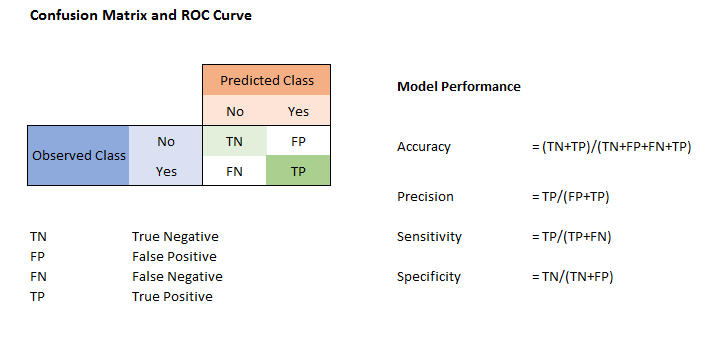
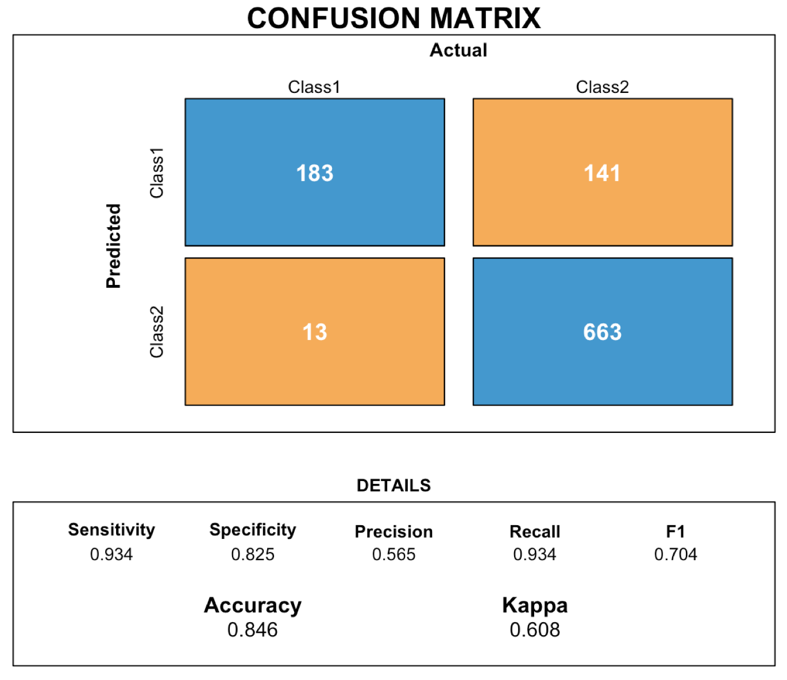
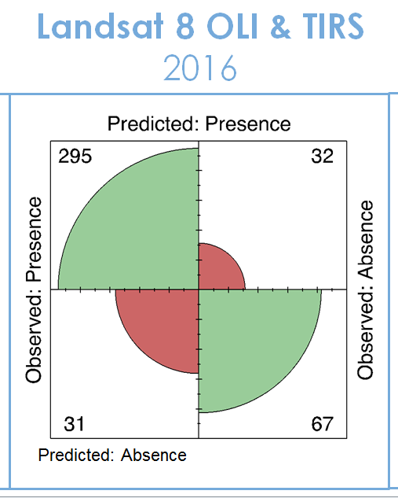
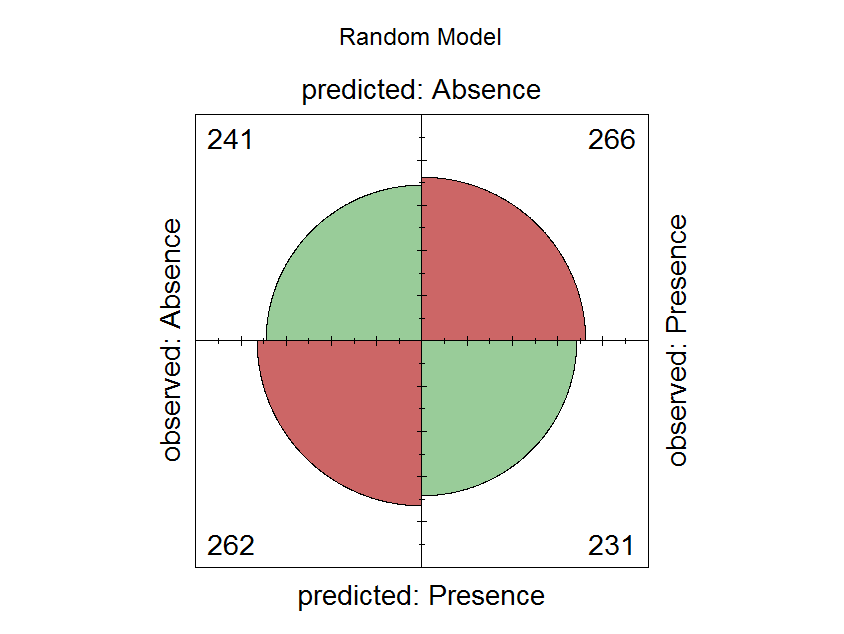

```{r setup, include=FALSE}
knitr::opts_chunk$set(echo = TRUE)
```

# Creating a Cirle Confusion Matrix 

This document will provide a basic background on confusion matrixes and provide the code for the generation of a circle or "bulleyes Confusion Matrix" that shows the proportion of the data distribution as well as the values. 

## Confusion Matrix; a model evaluation tool  

  A confusion matrix is a very common method of conveying the accuracy of binary land cover classifications. It plot **True Positive(TP), False Positive(FP), True Negitive(TN), and False Negitive(FN)** all within a single chart. From these values one can got on and calculate other statistical interpretations such as user's accuracy, produce's accuracy, True Skill statistics, sensitivity, specificity, and on and on and on. Each unique statistic has it's specific value the import thing to know is that they are all base on the four catergories described above (TP,FP,TN,FN). 

Here is an example of the framework for a consfusion matrix 



From this you can see that the point of the chart is to compare Predicted Class to the Observed Class. It how you can get at the actual accuracy of your model. 
The tricky part about this representation is that it is used by many different fields and therefore there is a huge variation in how the data is presented and spoken about. Check out the example below. 




What stands out here is that axis have been switched relative to the previous example. There is no standard here, the point is just that labelling is critical. 
The other thing that stands out the boxes just show a number. It's not a very data rich graphic. For example there are 13 False Positives compared to 141 False Negitive. That relationship seems import to display, but it easy to skip over given your just looking at numbers. 

### Bullseye Confusion Matrix. 
Our goal here is to make a more data rich confusion matrix that looks something like this. 


In this examples were going to generate this chart using random data. 
If your doing this in your own study you will need two pieces of information 

1. A binary column of your **observed values** 
  - From your training or ground truth data 
2. A binary column of your **predicted values** 
  - An output from a model 
  
These need to be the same length. 

```r
#set a random number seed for a reproduce process
set.seed(123)

#generate a dataframe with two columns with random values of either 0 or 1 
data <- data.frame(replicate(2,sample(0:1,1000,rep=TRUE)))

# rename columns to match prediction and observed 
names(data) <- c('predicted','observed')

```
Now that we have our dataframe esablished we can start building our confusion matrix 
We will start by using the accuracy tool in R
```r
#install the caret library to gain access to the confusion matrix function 
install.packages('caret', dependencies = TRUE)
library(caret)

#call the confusion matrix function on your predicted and referenced data sets 
confusionMatrix <- confusionMatrix(data$predicted,data$observed)

#take a look at the table out put 
confusionMatrix$table

#or just view all the outputs 
confusionMatrix

```

It's ok if all these outputs don't make sense, it would be wrong to present all this information to others. What they really want to know is the statistic that answer their question. 
In this case our **overall accuracy** is 0.472 Which makes sense considering we used random data. 

If we look at our table again 

```r
print(confusionMatrix$table)
```
There is just about the same number of True Positive (231), False Positive(262), True Negetive (241), and False Negetive (266)
Looking at our labels here is where are values fall. *labels are important* 
     0   |   1 
0 | TN   |   FN
1 | FP   |   TP


So again from this basic confusion matrix we can calculate all our statistics. It's just not that nice to look and it data poor. Let's jazz it up a bit. 

```r 
#create a new variable for ease of calling in the confusion matrix 
confusion2 <- confusionMatrix$table

#renames the labels to match the original inputs 
names(dimnames(confusion2)) <- c("predicted", "observed")

# define column and row names 
colnames(confusion2) <-c("Absence", "Presence")
rownames(confusion2) <-c("Absence", "Presence")


# call the fourfold plot function 
fourfoldplot(confusion2,
              color = c( "#99CC99", "#CC6666"),
              conf.level = 0,
              margin = 1,
               main = "Random Model")
               
```

A nicely label confusion matrix that shows the proportion of the 4 catergories should of appeared in your plots tab in rstudio 
You can export it using the graphical user interface or you can run the code below 

```r
#enter a path you your preferred output location
setwd("C:\\path\\to\\your\\workingDirectory")

#set parameters for the pdf output 
pdf("Confusion2_randomModel.pdf", height = 6, width = 6)

#use the dev.off function to export the feature in your plot based on the parameters set above
dev.off()
```





And there we are a nice looking confusion matrix with good symbology. All the data and statistics to base your analysis are still available in the code. 


